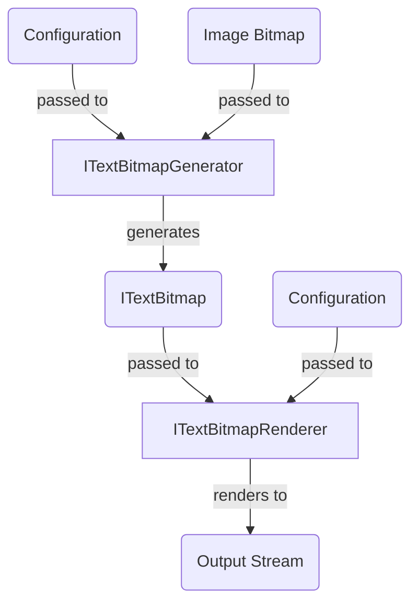

# `IText*` Types

## `ITextBitmap`

`ITextBitmap` is a bitmap of character data – like `char[,]`. The API exposes an indexer, `char this[int x, int y]` just like `char[,]` (2D `char` array).

The internal representation is implementation-defined. The underlying computation can be performed on the fly, or wrap around a pre-populated `char[,]` etc. Implementations are strongly encouraged to be immutable.

A reference implementation, `ArrayTextBitmap`, is provided. The underlying data is stored as `char[]` (1D `char` array).

In the future, `ITextBitmap` may expose more information about each "pixel" (such as color data).

## `ITextBitmapGenerator`

`ITextBitmapGenerator` converts an image bitmap to `ITextBitmap`. The generation strategy, and the concrete type of the returned `ITextBitmap`, are implementation-defined.

## `ITextBitmapRenderer`

`ITextBitmapRenderer` serializes `ITextBitmap` to an output `Stream`. The format of the output is implementation-defined.
