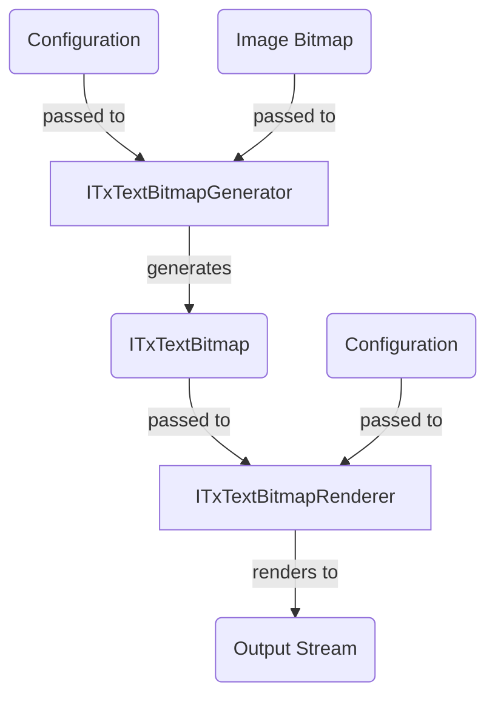

# `ITxText*` Types

## `ITxTextBitmap`

`ITxTextBitmap` is a bitmap of character data – like `char[,]` (2D `char` array). The API exposes an indexer-like method, `char ChatAt(int x, int y)` for 2D-array-like access.

The internal representation is implementation-defined. The underlying computation can be performed on the fly, or wrap around a pre-populated `char[,]` etc. Implementations are strongly encouraged to be immutable.

A reference implementation, `TxArrayTextBitmap`, is provided. The underlying data is stored as `char[]` (1D `char` array).

In the future, `ITxTextBitmap` may expose more information about each "pixel" (such as color data).

## `ITxTextBitmapGenerator`

`ITxTextBitmapGenerator` converts an image bitmap to `ITxTextBitmap`. The generation strategy, and the concrete type of the returned `ITxTextBitmap`, are implementation-defined.

## `ITxTextBitmapRenderer`

`ITxTextBitmapRenderer` serializes `ITxTextBitmap` to an output `Stream`. The format of the output is implementation-defined.

## Diagram

